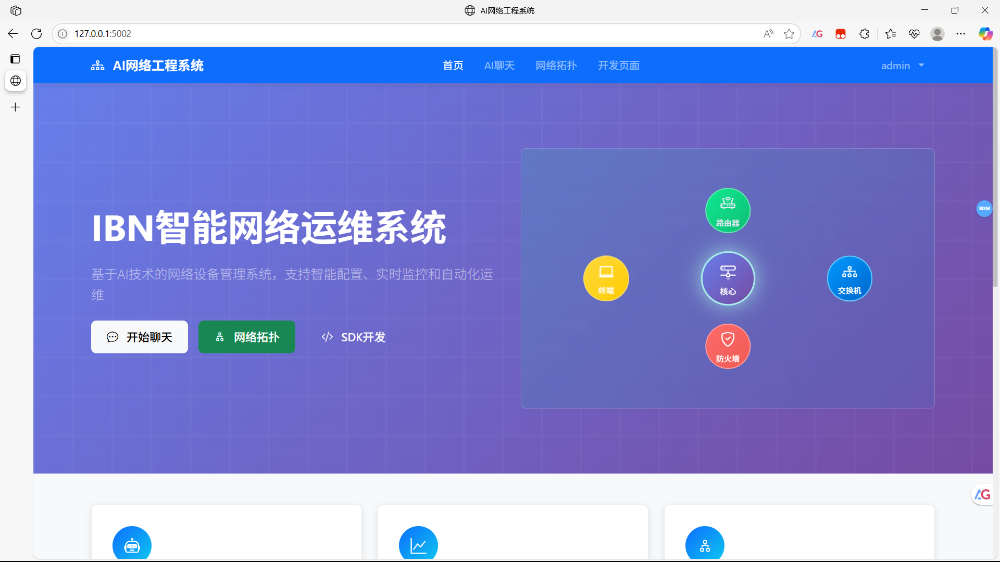
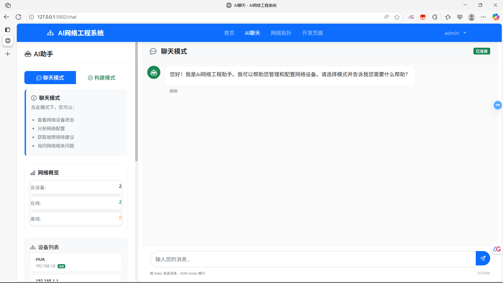
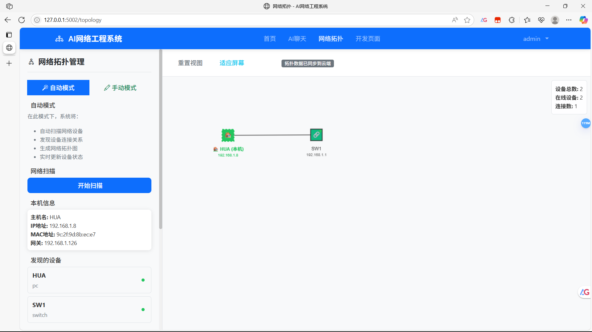
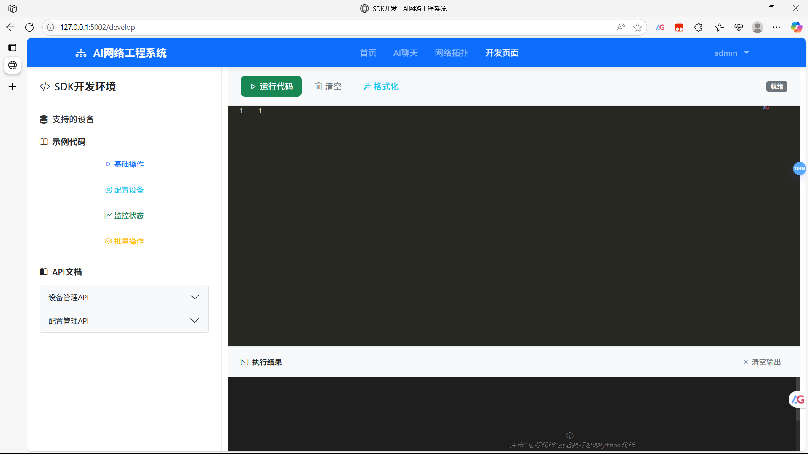
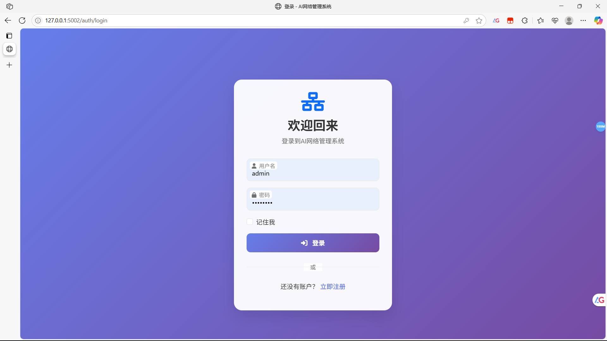
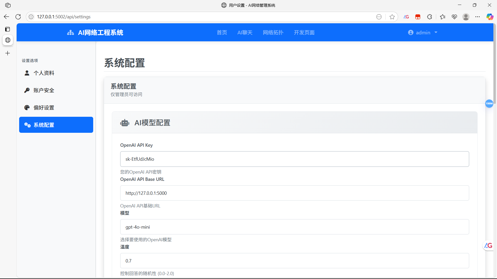
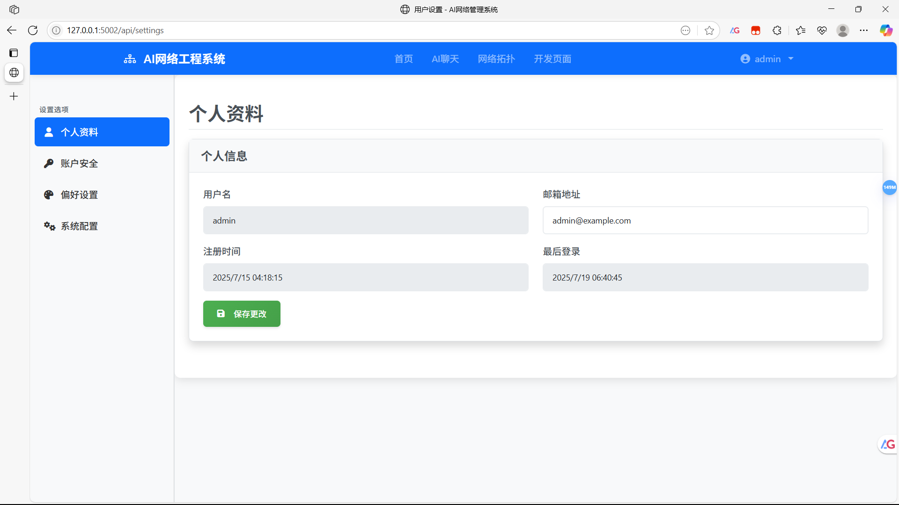

<div align="center">

# AI网络工程系统 (AI Network Engineering System)

[](https://opensource.org/licenses/MIT)
[](https://www.python.org/)
[](https://flask.palletsprojects.com/)
[](https://openai.com/)

<p align="center">让网络管理更智能，更简单！</p>



</div>

## 📖 项目介绍

AI网络工程系统是一个基于人工智能技术的网络设备管理系统，旨在提供智能化的网络配置、监控和运维解决方案。该系统结合了大型语言模型(LLM)的能力与传统网络管理工具，实现了网络拓扑可视化、设备配置自动化、智能问答等功能，为网络工程师和运维人员提供高效的工作平台。

本系统采用基于意图的网络(Intent-Based Networking, IBN)理念，通过AI技术理解用户意图，自动将高级需求转换为具体的网络配置和操作，大幅降低网络管理的复杂性和技术门槛。

注意:实验性项目，不建议生产使用！

## ✨ 主要功能

### 1. 🤖 AI智能交互



- **自然语言交互**：通过自然语言与系统交互，无需记忆复杂的命令
- **智能问答**：回答网络技术问题，提供故障排查建议
- **配置生成**：根据需求自动生成网络设备配置
- **代码解释**：分析和解释网络配置代码

### 2. 🌐 网络拓扑管理



- **可视化拓扑编辑**：直观的拖拽式网络拓扑设计
- **设备发现**：自动扫描并发现网络中的设备
- **连接测试**：测试设备间的连通性
- **拓扑导出/导入**：支持拓扑数据的导出和导入

### 3. 📱 设备管理
- **多厂商支持**：支持思科、华为、H3C等主流厂商设备
- **设备监控**：实时监控设备状态和性能
- **配置管理**：集中管理设备配置，支持配置备份和恢复
- **批量操作**：支持对多台设备执行批量操作

### 4. 🛠️ 开发者工具



- **SDK开发环境**：提供网络自动化开发环境
- **API接口**：完整的RESTful API支持
- **示例代码**：丰富的示例代码和文档

## 🏗️ 技术架构

### 前端技术
- **HTML5/CSS3/JavaScript**：构建响应式用户界面
- **Bootstrap**：UI框架，提供现代化的界面组件
- **CodeMirror**：代码编辑器，用于SDK开发环境

### 后端技术
- **Flask**：Python Web框架，提供API和页面渲染
- **SQLAlchemy**：ORM框架，数据库抽象层
- **OpenAI API**：集成大型语言模型能力
- **Socket.IO**：实现实时通信

### 数据库
- **SQLite**：默认数据库，轻量级
- **支持PostgreSQL/MySQL**：可配置使用其他关系型数据库

### 网络技术
- **Paramiko**：SSH客户端，用于设备连接
- **SNMP**：设备监控和信息收集
- **Netmiko**：网络设备自动化工具

## 🚀 使用方法



### 安装依赖
```bash
pip install -r requirements.txt
```

### 初始化数据库
```bash
python -c "from app import create_app; from models import db; app = create_app(); app.app_context().push(); db.create_all()"
```

### 重置管理员密码（如需）
```bash
python reset_password.py
```

### 启动应用
```bash
python app.py
```

### 访问系统
打开浏览器访问 `http://localhost:5002`

## 💻 部署平台

本系统支持在以下平台部署：
- **Windows**：支持Windows 10/11
- **Linux**：支持Ubuntu, CentOS等主流发行版
- **MacOS**：支持最新版本
- **Docker**：提供容器化部署
- **Kubernetes**：支持云原生部署

## 🔮 未实现目标

以下是计划中但尚未实现的功能：

| 序号 | 功能名称 | 功能描述 |
|------|---------|----------|
| 1 | 自定义工具<br>(Customization Tool) | 允许用户创建和定制自己的网络管理工具，扩展系统功能。 |
| 2 | 工作流<br>(Workflow) | 支持定义和执行自动化工作流，实现复杂网络操作的自动化。 |
| 3 | 多AI处理驱动<br>(Multiple LLM Driver, MLD) | 支持多种AI模型，根据不同任务选择最适合的模型。 |
| 4 | 自定义/训练AI模型<br>(Customization/Train LLM Model) | 允许用户使用自己的数据训练和微调AI模型，提高特定领域的准确性。 |
| 5 | AI拓扑嗅探<br>(LLM Sniffing Network Topology, LSNT) | 利用AI技术自动分析网络流量，推断网络拓扑结构。 |
| 6 | 开发人员工具/SDK<br>(IBN Network Software Development Kit) | 提供完整的SDK，支持第三方开发者扩展系统功能。 |
| 7 | AI实时监控/运维<br>(LLM Real-time Monitoring/Maintenance) | 利用AI技术实时监控网络状态，自动发现并解决潜在问题。 |
| 8 | 在线命令行<br>(Online Command Line) | 提供基于Web的命令行界面，支持远程执行网络命令。 |
| 9 | 拓扑配置生成<br>(Topology Generate Config) | 通过读取拓扑数据自动生成每台设备的配置信息，用于配置SSH全网通。 |

## 👥 贡献指南

欢迎贡献代码或提出建议！请遵循以下步骤：

1. Fork 本仓库
2. 创建您的特性分支 (`git checkout -b feature/amazing-feature`)
3. 提交您的更改 (`git commit -m 'Add some amazing feature'`)
4. 推送到分支 (`git push origin feature/amazing-feature`)
5. 打开一个 Pull Request

## 📄 许可证

本项目采用 MIT 许可证 - 详情请参见 LICENSE 文件

---

<div align="center">

### 系统设置

 

**AI网络工程系统** - 让网络管理更智能，更简单！

</div>
